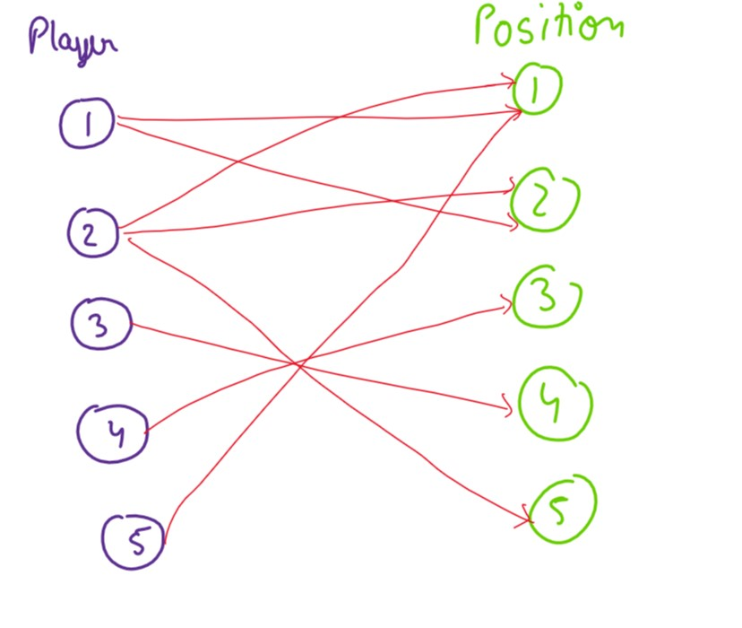
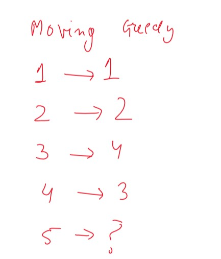
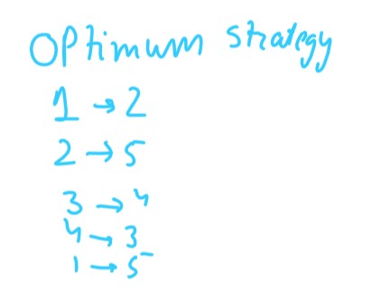
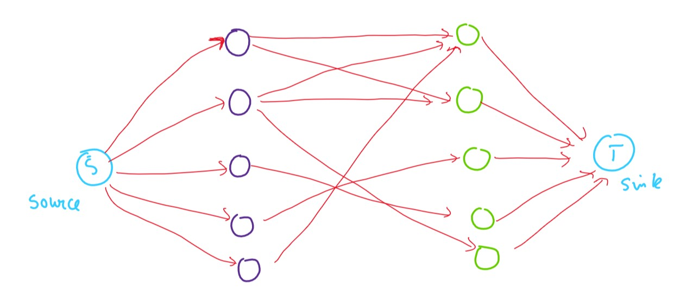

# Maximum Bipartite Matching 

Let us say i have 7 batters, these 7 are the best in the nation so i want to play all of them. I have 7 positions in the team, each batter has his own prefernce that is he wants to play at a certain position. Using Maximum Bipartite Matching it would be easy to determine if the players would be able to play. That every position must have a single batsman

# Greedy won't work



This is an example, right now i have taken info about five players.

If we go greedy, that is i will move from 1st player to 5th player and for each player i would select the first position that is available.

In that case:



But the optimum answer would be:



This can be solved by Using Ford Fulkerson Algorithm for max flow.

We would need to change the graph a bit, we will add a dummy source and sink node, a source node will have outgoing edge to all the players and sink will have an incoming edge from all the positions.

The graph would look like:



Here an edge can have 2 values that is either 1 or 0. 1 meaning the batsman is going to play at that position, 0 meaning the opposite. We would apply Ford-Fulkerson Algorithm for max flow between Source and Sink which will give us our desired outcome.

## Ford - Fulkerson Psuedo code
1. Set Total flow equal to 0
2. Repeat the below steps till we have a valid path from source s to sink t
    1. Run depth first search to find the path from s to t
    2. Let the minimum capacity value on the path be f
    3. Add f to the total flow
3. On this path for every edge we need to do
    1. Decrease capacity of edge u->v by f
    2. Increase capacity of edge v->u by f

## code

```cpp
    int sent = dfs(s,t,LARGE_NUMBER);
    while (sent >0) {
        max_flow += sent;
        memset(visited, 0, sizeof(visited));
        sent = dfs(s,t,LARGE_NUMBER);
    }

    // the dfs function is
    int dfs(int s, int t, int minimum) {
    visited[s] = true;
    if (s == t)
        return minimum;
    for (int i = 0; i < N; i++) {
        int flow_capacity = graph[s][i] - Flow[s][i];
        if (!visited[i] && flow_capacity > 0) {
            if (int sent = dfs (i, t, min (minimum, flow_capacity))) {
                Flow[s][i] += sent;
                Flow[i][s] -= sent;
                return sent;
            }
        }
    }
    return false;
}
```