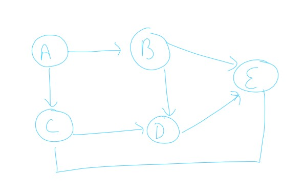
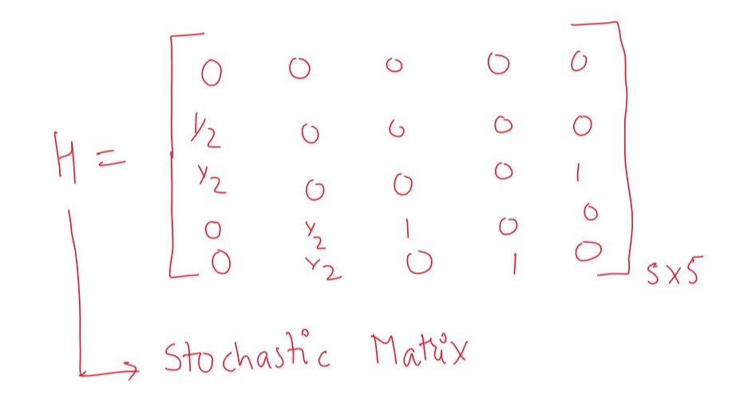
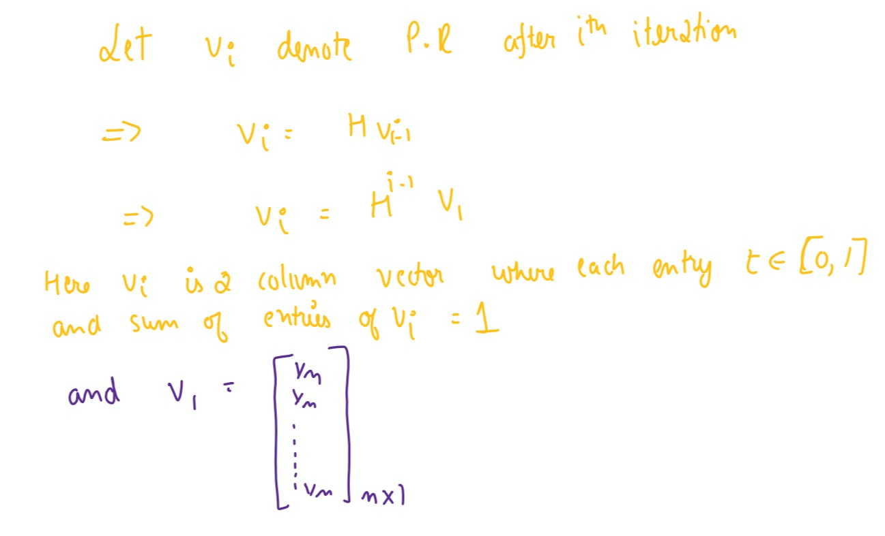

# PageRank Algorithm

# History

It is named after Larry Page, one of the co-founder of Google. It was used by google search to rank the websites in their search result.

## Making Graph

The websites they want to show are taken as nodes, the next step to form a network from these nodes.

Let us say the node i {website i} has a hyperlink that on clicking redirects the user to node j {website j} then it informally we can say that website j is more important. Therefore we would add a directed edge from node i to node j. 

The process of making the graph and getting the hyperlink uses **BFS -   Breadth First Search**, this process is commonly known as web crawling.

## Quality and Quantity

We know that the importance can't only be determined by the number of incoming edges. Had only number of incoming edges been used people would have easily hack google search engine by making 1000 dummy website that has a link to the website they want to rank higher.

Therefore the ranking algorithm must also consider the quality of the coming links.

# Iterative Formula

Here PR_t is the page rank of P_i node after t iterations.

P_j are the nodes that have a directed edge going from P_j to P_i.

C(P_j) is the number of out-going links from node P_j.

We need to run this formula until it stabilize.

Initially we can give everybody the same rank. We will get the value of PR and sort it to get the rank, PR would be number between 0 and 1. Thus it is a probability kind of a thing.

# Matrix Representation

For the above graph the probability matrix, i.e if we are at node A then the column 1 will contain the probability that we will go to node B,C and so on:

H is the matrix formed then deriving the equation

It is a very famous Stochastic Matrix where the sum of entries in the column are equal to 1.

For this kind of system at steady state the vale of eigenvalue will be 1 and the corresponding eigenvector will be the final answer we are looking for.

## Dangling nodes

The nodes that don't have any outgoing edge. Therefore these nodes will cause some issues to stochastic matrix and the transitions. Let that dangling node be i then the i(th) column of the matrix will look like [0,0,0,0,0,0,0,0]^T {used transpose because to write}. Then after some transition the page rank value will turn equal to 0. To overcome this problem we assume a directed edge from this node to all the other nodes 

## Disconnected Graph

They too add an issue to the Markov chain. This creates a situation where we have more than 1 connected components, there is no links between them causing the algorithm to give infinitely many solutions to overcome this we use a random edge to connect these components.

# Damping Factor

There is also one more thing we should consider, that is if a person is surfing the net then he may suddenly choose a click that is not on the current website. For ex if there are four websites A,B,C,D. The user is currently on website A and website A have links to website B and C. There is high probability that he will click on either B or C but he may change his mind and directly go to website D. So to take care of this we introduce a damping factor that is to add probability whether he would surf the current links or will change his mind.

Therefore the final equation becomes:

**β** is the probability that we would go to the links in the current side. Also known as damping factor.

**P** is the transition matrix

**M** is square matrix of n*n where each entry is 1/n.

**R** is our new transition matrix.

# Page rank in cricket

## Player of the match

Earlier the procedure to select the player of the match was according to a point system, where for each run batsman was given 1 point and for each wicket taken bowler was given 25 points. This system lacked the impact the player's performance was sometime the bowler might take 2 wickets but those 2 were better batsman whereas some other bowler who took 5 wickets of batsman that didn't score much score would have high points. Now to select the player of the match they do a voting between their panel of cricket experts to choose the player. This is often emotional and highly subjective therefore i tried to find the man of the match using the PageRank algorithm.

[Click here to see the info about it](Pagerank/POM/README.md)

## Most Valuable Batter

From the data of partnerships in the current season we can figure out which batter is the most valuable to the team.

[Click here for more info](Pagerank/MVB/README.md)

## Breaking Ties

In case of ties in knockout games, it is essential to determine a winner. In football they have extra-time and penalty which though is a better way to determine the result but in cricket we have super-over. To determine the outcome of a 50 over match we play a single over match doesn't seem to be a nice idea. I think we can use their rank (calculated by PageRank Algorithm) based on the matches played in group stage to decide the winner.

[Click here for more info](Pagerank/Team_Ranking/README.md)