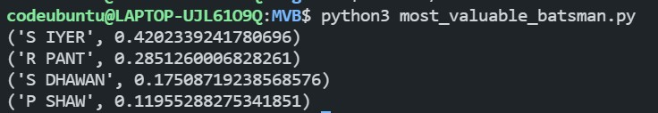
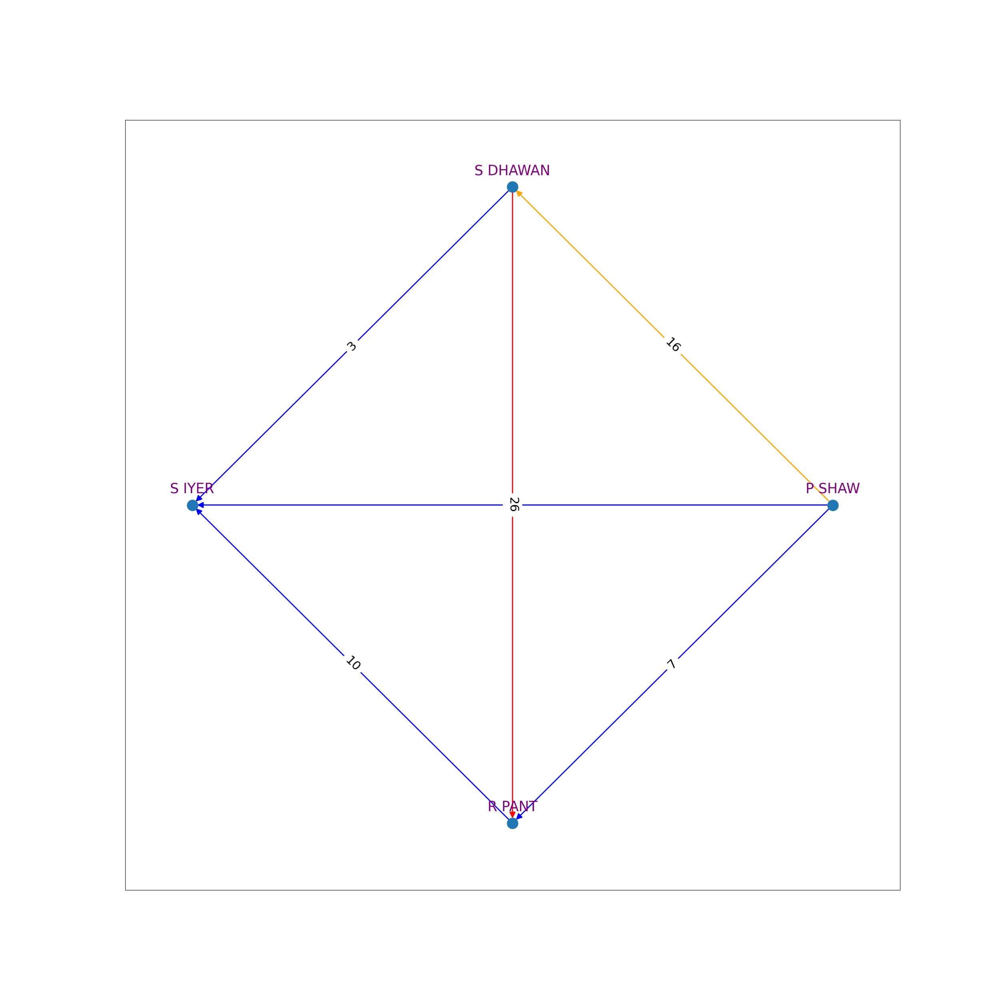

## Most Valuable Batter

From the data of partnerships in the current season we can figure out which batter is the most valuable to the team.

# Data

Since it was not easily available i got data for the only the 4 main batsman of team "Delhi capitals".

```csv
1,S Dhawan,PP Shaw,204,188
2,S Dhawan,SS Iyer,179,182
3,S Dhawan,RR Pant,75,101
4,SS Iyer,PP Shaw,88,80
5,RR Pant,PP Shaw,73,66
6,SS Iyer,RR Pant,111,101
```

Explanation

For the 6th it means for the partnership between Iyer and Pant Iyer added 111 runs and Pant made 101 runs.

# Creating graph

A weighted edge of weight difference of runs is added from the less dominating batter to the more dominating batter.

# Running the code

```sh
python3 most_valuable_batsman.py
```

# Results



The neural network looks like



This data is from 2019 so if Delhi had to retain only 1 player among these 4 so they should go for Shreyas Iyer.

 