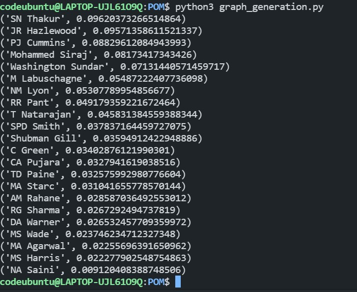

# Player of the match

Earlier the procedure to select the player of the match was according to a point system, where for each run batsman was given 1 point and for each wicket taken bowler was given 25 points. This system lacked the impact the player's performance was sometime the bowler might take 2 wickets but those 2 were better batsman whereas some other bowler who took 5 wickets of batsman that didn't score much score would have high points. Now to select the player of the match they do a voting between their panel of cricket experts to choose the player. This is often emotional and highly subjective therefore i tried to find the man of the match using the PageRank algorithm.

## Making Graph

There are 2 cases for which edge will be added

1. Batter made 'x' run against a particular bowler

2. Bowler dismissed a particular batter.

### Case 1

A weighted directed edge of weight 'x' from bowler to batter is added.

### Case 2

A weighted directed edge of weight '15' from the batsman to the bowler is added.

**Note** there might be different ways to create a graph.

## Running the code

```sh
python3 graph_generation.py
```

The code is hard-coded in such a manner that it needs the file gabba_test.csv

# Results

I tried to find the Player of the Match for the famous Gabba test played between India and Australia in 2021.



This shows that Shardul Thakur should be the player of the match, since he had more impact (in terms of runs and wickets). But Rishab Pant was chosen as POM (and his knock was one of the most remarkable one).

This result also shows that Bowlers had more impact on this game. To win a test match you need to pick 20 wickets so bowler do have a higher impact in the game.

Shardul Thakur  - 69 runs and 7 wickets

Rishab Pant - 112 runs
