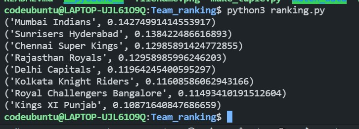
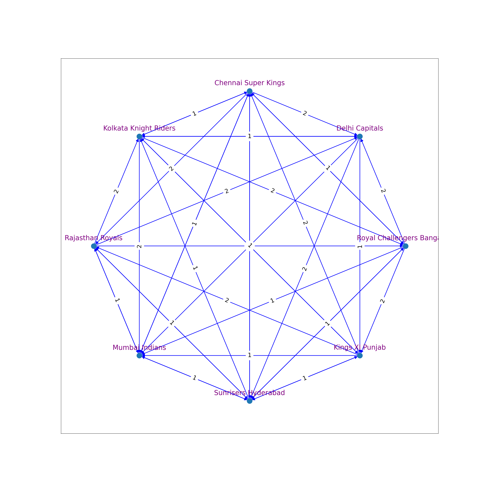

## Breaking Ties

In case of ties in knockout games, it is essential to determine a winner. In football they have extra-time and penalty which though is a better way to determine the result but in cricket we have super-over. To determine the outcome of a 50 over match we play a single over match doesn't seem to be a nice idea. I think we can use their rank (calculated by PageRank Algorithm) based on the matches played in group stage to decide the winner.

# DATA

I have used the data of IPL 2020, it was a round robin tournament, each team player twice with the other team.

# Creating graph

Team 'A' defeated Team B 'x' times

Then i have added a edge of weight x from B to A.

x will belong to {1,2}

**Note** : The game tied are not included because didn't have proper data for them

# Running the code

```sh
python3 ranking.py
```

# Result



The neural network looks like:



A better way to assign the weights would have been to take the difference of scoring rates of the two teams.

