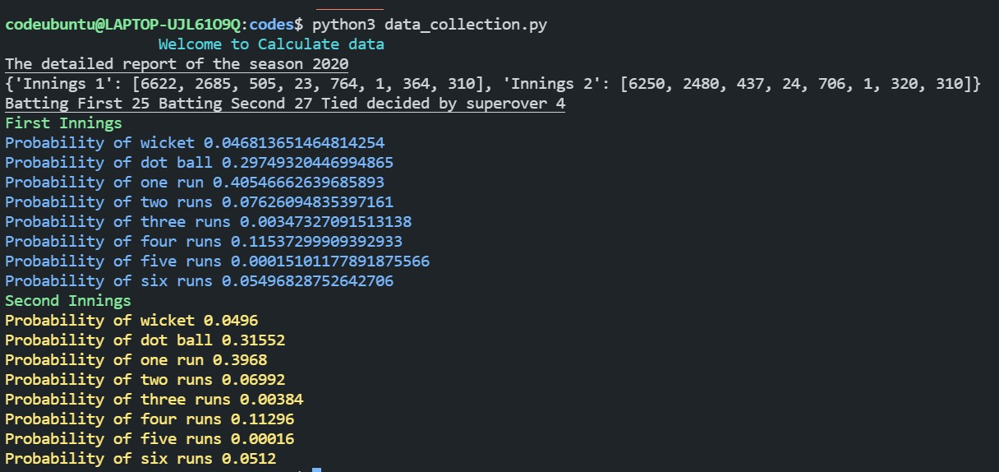

# example 1

# Predicting the score

## Cricketing background

In cricket on a legitimate delivery a batsman can score 0,1,2,3,4,5,6 runs or he may get out. Considering only legitimate deliveries this will rule out no-balls,wide and leg-byes.

So on a given delivery it is safe to assume summation i=0 to i=6 P(scoring i runs) + P(getting a wicket) =1.

The score a team will further add usually depends upon several things those are

1. Number of overs left

2. Number of wickets in hand

3. Form of batsman that are playing and will come to bat next.

To get data of form of a player would make things highly subjective so for calculation purposes i have avoided 3rd factor and used 1st and 2nd only.

Let f(i,j) be a function (it is also our dp state)

here i means the number of balls left and j means the number of wickets in hand.

f(i,j) gives us the runs a team is expected to score with i balls left and j wickets in hand.

So as already stated we have 8 cases/ events that may happen on a single delivery but this can be classified into 2 events. (will see its benefit in later stages)

1. Wicket delivery - meaning the batsman got out, therefore we are left with i-1 balls and j-1 wickets.
2. Non wicket delivery - meaning the batsman scored 't' runs t belongs to [0,6] , leaving us with i-1 balls and j wickets

So we can formulate it :

f(i,j) = P(W).f(i-1,j-1) + P(0)(0+f(i-1,j)) + P(1)(1+f(i-1,j)) + P(2)(2+f(i-1,j)) + P(3)(3+f(i-1,j)) + P(4)(4+f(i-1,j)) + P(5)(5+f(i-1,j)) + P(6)(6+f(i-1,j))

here P(W) probability of falling of wicket, P(t) where t={0,1,2,3,4,5,6} means probability of scoring t runs.

If we expand it, we can reduce the expression length.

summation t=0 to t=6 t.P(t) is known as expected runs on a non-wicket delivery and we can take f(i-1,j) common thus the expression becomes

f(i,j) = P(W).f(i-1,j-1) + (1-P(W)).f(i-1,j) + E(R)

To calculate f(i,j) we can write a simple program but we need to know the value of constants P(W) and E(R).

## Calculating probabilities

I have calculated the probabilities from the code [link]() .

I have used [cricsheet.org](https://cricsheet.org/) to get ball by ball data of IPL 2020 and using that i have calculated probability.

Since this tournament happened on 3 grounds that had similar pitches so this will provide us with good resource, the final results would also be in accordance with these grounds and pitches.

Since in commentary i have heard many times commentator saying that it is easier for batsman in second innings to score more easily because of dew but the data was consistent across both innings and there was no high significance of toss.

 

So i just used took the average and rounded the probabilities to write the code for making a table so you can find the code at [link]().

 

This shows that a team is expected to score around 160 before the start of the game but if they loose early wickets they might not be able to reach there.
