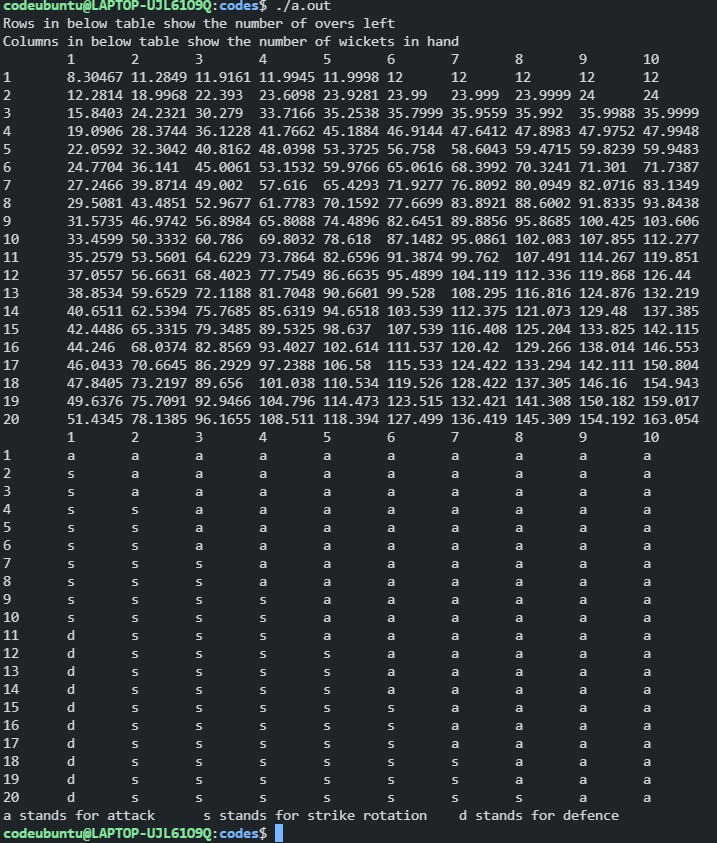

# Example 2

# Play Style

In the previous example we calculated `dp[i][j] = f(i,j)` where i means the number of balls left and j means the wicket in hand.

Now we will add something more to that example.

Let us assume a batsman can play 3 different kinds of shot namely

1. Defense 
2. Strike Rotation
3. Attack

Every kind of gameplay comes with a certain risk, probability of getting out while playing defense is very less as compared to playing attacking cricket. 

Whereas the expected runs scored per ball while playing attacking cricket is far more than playing defensive.

Therefore it depends upon the situation which to play and when.

## Probability taken for this example

Since there is not any data available on internet so i cooked probability myself

SHOT					Probability(Wicket)				Expected runs per ball 

Defense 			  0.00001									0.3

Strike Rotation	0.015										0.8

Attack					0.15										 2

It seems like Strike rotation is the best options but if we have quite a high number of wickets in hand it is better to play an attacking innings and with less wicket in hand it is advised to play defensively.

## Forming Equations

Let `dp[i][j]` denote the maximum number of runs the team can make having i balls and j wickets in hand.

So the base state are quite simple

`dp[0][j]=0 for all 0<=j<=10`. Since the number of balls left are 0

`dp[i][0]=0 for all 0<=i<=120` Since there are no wickets left.

On each ball we have 3*2 cases i.e.  3 different kind of shots and on each shot we would have either a wicket delivery or a non wicket ball.

Since on a particular ball batsman can play only 1 kind of shot so we need to play that shot which will result in maximum `dp[i][j]`.

Therefore `dp[i][j] = max(f(attacking shot),f(defensive shot),f(strike rotation))`

`f(attacking shot)` is the expected score team will make with i balls remaining and j balls left and they have decided to attack on the current ball.

`f(attacking shot) = P_a(W)dp[i-1][j-1] + (1-P_a(W))(dp[i-1][j]) + E_a` where P_a(W) denotes the probability of dismissal while playing an attacking shot and E_a is the expected number of runs we would make while playing an attacking shot.

In similar fashion we can write logic for defensive and strike rotation strategies

```cpp
for(int i=1;i<number_of_balls;i++)
    {
        for(int j=1;j<number_of_wickets;j++)
        {
            double dp_d,dp_a,dp_s;
            dp_d = (0.00001*dp[i-1][j-1])+(0.99999*dp[i-1][j]) +0.3;
            dp_s = (0.015*dp[i-1][j-1])+(0.985*dp[i-1][j]) +0.8;
            dp_a = (0.15*dp[i-1][j-1])+(0.85*dp[i-1][j]) +2;
            dp[i][j]=max({dp_d,dp_s,dp_a});
            if(dp[i][j]==dp_d)
            {
                play_style[i][j]='d';
            }
            else if(dp[i][j]==dp_s)
            {
                play_style[i][j]='s';
            }
            else
            {
                play_style[i][j]='a';
            }
        }
    }
```

play_style is used to store what kind of shot we should play that will maximize our function.

[For the full code click here]()



This does show what commentators say, i.e. in the beginning of the innings go for strike rotation keep wickets in hand and later opt the attacking style.