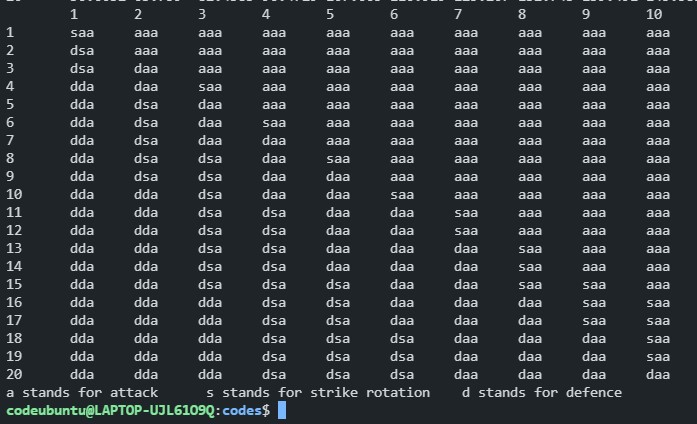

# Example 3

# Play Style For Different Balls

This is an extension to example 2. In example 2 we talked about how batsman have 3 different kind of strategies, in this example we would take in consideration 3 different kind of balls a bowler may bowl.

## Types Of ball

Let us assume a bowler may bowl

1. A good delivery
2. A medium delivery
3. A bad delivery

In general on a delivery attacking game had more probability of causing a wicket. In this probability of taking a wicket will be highest when the batsman is trying to play aggressively on a good delivery and the maximum expected run per ball will be when a batsman is playing aggressively on bad delivery.

## Probability

1. Good Delivery

   SHOT					Probability(Wicket)				Expected runs per ball 

   Defense 			  0.02										   0.03

   Strike Rotation	0.1    										0.5

   Attack					0.2  										 1

2. Medium Delivery

   SHOT					Probability(Wicket)				Expected runs per ball 

   Defense 			  0.01										   0.05

   Strike Rotation	0.05    									  0.65

   Attack					0.15  									   1.5

3. Bad Delivery

   SHOT					Probability(Wicket)				Expected runs per ball 

   Defense 			  0.001										   0.07

   Strike Rotation	0.01    										0.8

   Attack					0.02  										 2

	## Forming Equations

Let `dp[i][j]` denote the maximum number of runs the team can make having i balls and j wickets in hand.

Let us denote `dp_g[i][j] `be the maximum number of runs the team will make if the current ball is a good one. In similar way we can define `dp_m[i][j]` and  `dp_b[i][j]`

In batting we want to maximize runs so we will have different choice. But in bowling we want to ball as many good balls as possible as there are no advantage of bowling the other one, had this being possible to bowl a good delivery every single time probably machines have taken over the human body.

Therefore we can assume the the current may be good or bad or medium they all have some probability.

This probability will vary for different bowler, this is again quite subjective. (Though usually the 5th bowler in the team is considered to be a weak link it is advised to target that bowler as he will bowl quite a few bad balls).

Right now i am assuming that the probability of bowling a good is equal to probability of bowling a medium ball is equal to probability of bowling a bad ball = 1/3.

Our equation 1 becomes

`dp[i][j] = (dp_g[i][j] + dp_m[i][j] + dp_b[i][j])/3` 

To calculate `dp_g[i][j]`, this similar to what we did in example 1 and 2

`dp_g[i][j] = max{dp_ga,dp_gs,dp_gd}` where `dp_ga` means we have decided to play an attacking shot on a good delivery.

`dp_ga = P_ga(W)*dp[i-1][j-1] + (1-P_ga(W))*dp[i-1][j] + E_ga` here `P_ga(W)` and `E_ga` means probability of  taking a wicket on a good delivery while playing an attacking shot and Expected runs one would score on good deliver while playing an attacking shot respectively.

The code for it is:

```cpp
for(int i=1;i<number_of_balls;i++)
    {
        for(int j=1;j<number_of_wickets;j++)
        {
            double dp_g,dp_m,dp_b;
            double dp_gd,dp_gs,dp_ga,dp_md,dp_ms,dp_ma,dp_bd,dp_bs,dp_ba;
            dp_gd = (0.02*dp[i-1][j-1])+(0.98*dp[i-1][j]) +0.03;
            dp_gs = (0.1*dp[i-1][j-1])+(0.9*dp[i-1][j]) +0.5;
            dp_ga = (0.2*dp[i-1][j-1])+(0.8*dp[i-1][j]) +1;
            dp_g=max({dp_gd,dp_gs,dp_ga});
            dp_md = (0.01*dp[i-1][j-1])+(0.99*dp[i-1][j]) +0.05;
            dp_ms = (0.05*dp[i-1][j-1])+(0.95*dp[i-1][j]) +0.65;
            dp_ma = (0.15*dp[i-1][j-1])+(0.85*dp[i-1][j]) +1.5;
            dp_m=max({dp_md,dp_ms,dp_ma});
            dp_bd = (0.001*dp[i-1][j-1])+(0.999*dp[i-1][j]) +0.07;
            dp_bs = (0.01*dp[i-1][j-1])+(0.99*dp[i-1][j]) +0.8;
            dp_ba = (0.02*dp[i-1][j-1])+(0.98*dp[i-1][j]) +2;
            dp_b=max({dp_bd,dp_bs,dp_ba});

            if(dp_g==dp_gd)
            {
                play_style[i][j].push_back('d');
            }
            else if(dp_g==dp_gs)
            {
                play_style[i][j].push_back('s');
            }
            else if(dp_g==dp_ga)
            {
                play_style[i][j].push_back('a');
            }
            if(dp_m==dp_md)
            {
                play_style[i][j].push_back('d');
            }
            else if(dp_m==dp_ms)
            {
                play_style[i][j].push_back('s');
            }
            else if(dp_m == dp_ma)
            {
                play_style[i][j].push_back('a');
            }
            if(dp_b==dp_bd)
            {
                play_style[i][j].push_back('d');
            }
            else if(dp_b==dp_bs)
            {
                play_style[i][j].push_back('s');
            }
            else
            {
                play_style[i][j].push_back('a');
            }

            dp[i][j]=(dp_b+dp_g+dp_m)/3;
        }
    }
```

 `play_style[i][j]` will be string of three character, if it looks like 'xyz' then that means x is the shot played on a good delivery, y on medium and z on the bad one.

[To the access the full code check](DP/codes/example3.cpp)



This show something peculiar no matter what the current situation is if it is a bad ball it is advised to play aggressively.

