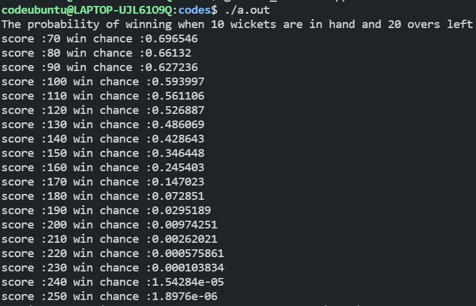
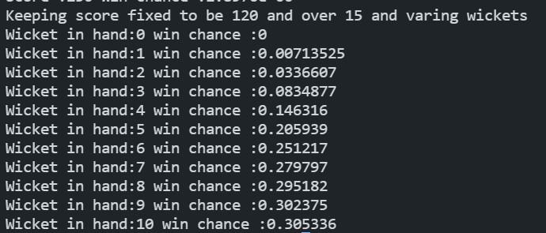

# EXAMPLE 4

# WINNING CHANCE

All the dynamic programming we have used in example 1,2,3 is for team batting in the first innings, we were trying to maximize the runs they can score in second innings there is a slight difference.

For the team batting second they know the target before hand, so they know how to pace their innings, in most of the scenario we don't finish the target early. But we can use dynamic programming to calculate the probability of them chasing the target provided the resources they have.

## DP STATE

Let `dp[i][j][k]` denote the probability of chasing the target of 'j' runs with 'i' balls remaining and 'k' wickets in hand. For this i have **not considered** the different kind of shots the batsman can play and different kind of balls the bowler bowls.

So from the example 1 i have calculated the probabilities using the data of **IPL 2020**

## Probabilities And Given Constrains

```cpp
#define prob_wicket 0.05
#define prob_dot 0.3
#define prob_1 0.4
#define prob_2 0.07
#define prob_3 0.004
#define prob_4 0.114
#define prob_5 0.00016
#define prob_6 0.055
#define number_of_balls 120
#define number_of_wickets 10
#define score_max 250
```

These are quantities and their value i have used in the code i have taken number of balls to be 121 as it helps to initialize the array in a better way

## Base State

So when wickets i hand are equal to 0 this implies that the probability would be 0.

Therefore,		

`dp[i][j][0] = 0`  where  `0<=i<=120` and `1<=j<score_max` 

`dp[0][j][k] = 0`  where  `0<=k<=10` and `1<=j<score_max` 

these two are cases where the team has no balls left or the team is all out.

`dp[i][t][k] = 1` where `0<=i<=120` and `0<=k<=10` and `t={0,-1,-2,-3,-4,-5}`

This is the condition when team has won the game, t can be in negative considering the fact that chasing team can hit a 6 when 2 runs were left so in that case t would become -4.

## Transition

On a delivery we have 8 cases that are:

Wicket, dot ball, 1 run, 2 run, 3 run, 4 run, 5 run and 6 run.

so equation becomes 

`dp[i][j][k] = P('W').dp[i-1][j][k-1] + (summation t=0 to t=6) P(t).dp[i-1][j-t][k]`

```cpp
for(int n=1;n<number_of_balls;n++)
{
    for(int s=1;s<=score_max;s++)
    {
        for(int i=1;i<number_of_wickets;i++)
        {
            if(s==1)
                dp[n][s][i] = (prob_wicket*dp[n-1][s][i-1]) + (prob_dot*dp[n-1][s][i]) + (prob_1 + prob_2 + prob_3 + prob_4 +prob_5 +prob_6); 
            else if(s==2)
                dp[n][s][i] = (prob_wicket*dp[n-1][s][i-1]) + (prob_dot*dp[n-1][s][i]) + (prob_1*dp[n-1][s-1][i]) + (prob_2 + prob_3 + prob_4 +prob_5 +prob_6); 
            else if(s==3)
                dp[n][s][i] = (prob_wicket*dp[n-1][s][i-1]) + (prob_dot*dp[n-1][s][i]) + (prob_1*dp[n-1][s-1][i]) + (prob_2*dp[n-1][s-2][i])+ (prob_3 + prob_4 +prob_5 +prob_6); 
            else if(s==4)
                dp[n][s][i] = (prob_wicket*dp[n-1][s][i-1]) + (prob_dot*dp[n-1][s][i]) + (prob_1*dp[n-1][s-1][i]) + (prob_2*dp[n-1][s-2][i]) + (prob_3*dp[n-1][s-3][i]) + (prob_4 +prob_5 +prob_6); 
            else if(s==5)
                dp[n][s][i] = (prob_wicket*dp[n-1][s][i-1]) + (prob_dot*dp[n-1][s][i]) + (prob_1*dp[n-1][s-1][i]) + (prob_2*dp[n-1][s-2][i]) + (prob_3*dp[n-1][s-3][i]) + (prob_4*dp[n-1][s-4][i]) +(prob_5 +prob_6); 
            else if(s==6)
                dp[n][s][i] = (prob_wicket*dp[n-1][s][i-1]) + (prob_dot*dp[n-1][s][i]) + (prob_1*dp[n-1][s-1][i]) + (prob_2*dp[n-1][s-2][i]) + (prob_3*dp[n-1][s-3][i]) + (prob_4*dp[n-1][s-4][i]) +(prob_5*dp[n-1][s-5][i]) +(prob_6); 
            else
                dp[n][s][i] = (prob_wicket*dp[n-1][s][i-1]) + (prob_dot*dp[n-1][s][i]) + (prob_1*dp[n-1][s-1][i]) + (prob_2*dp[n-1][s-2][i]) + (prob_3*dp[n-1][s-3][i]) + (prob_4*dp[n-1][s-4][i]) +(prob_5*dp[n-1][s-5][i]) +(prob_6*dp[n-1][s-6][i]); 
        }
    }
}
```

This is how the code looks like, i have made cases as array can't take negative values. To see the full code [click here]()

Some results:



